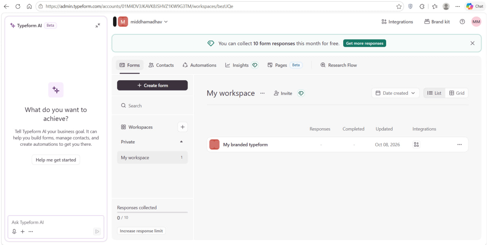
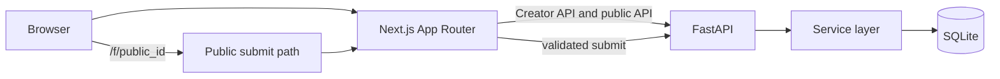
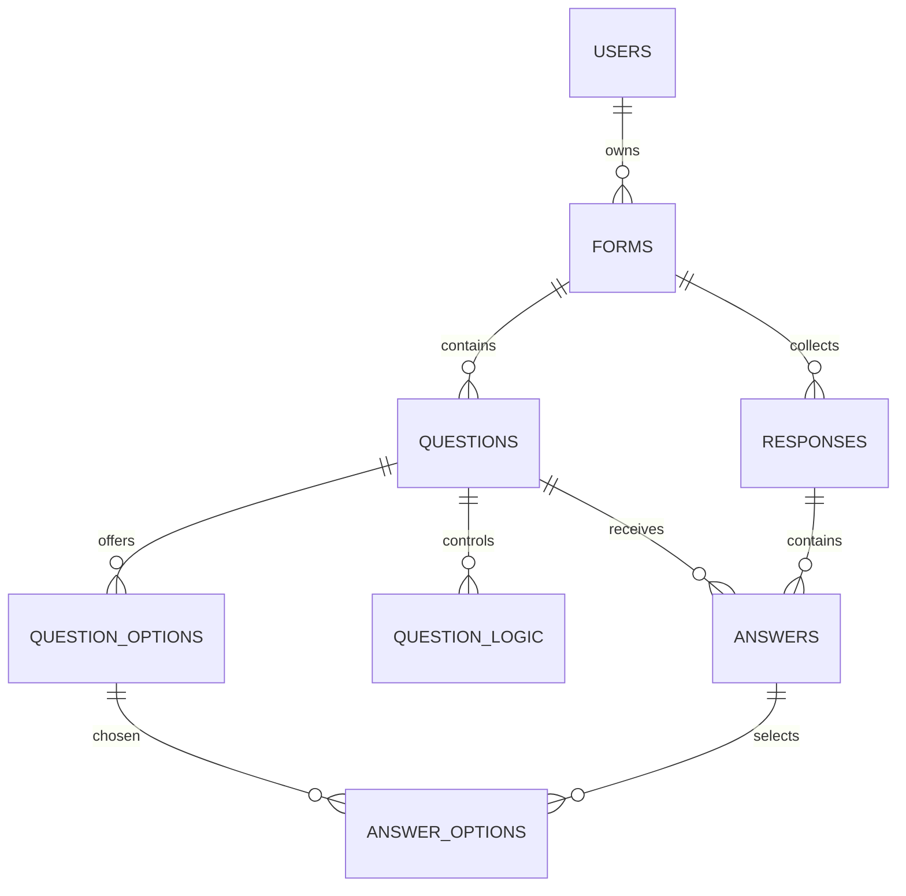

# Typeform Builder

## Overview

Typeform Builder is a functional Typeform-inspired workspace: a creator builds
and publishes forms, respondents answer one question at a time, and the creator
reviews summaries, responses, and spreadsheet exports.

| Screenshot placeholder | Preview |
|---|---|
| Dashboard |  |

## Live demo and repository

- Live demo: **DEMO_URL_HERE**
- GitHub repository: **REPO_URL_HERE**

## Features mapped to the assignment

| Assignment area | Implementation |
|---|---|
| Core Feature 1: form creation | Dashboard, create/rename/duplicate/delete, seeded creator |
| Core Feature 2: form builder | Drag-and-drop questions, typed settings, autosave, welcome/thank-you screens |
| Core Feature 3: publish and share | Draft/published lifecycle, public URL, QR code, social links, iframe snippet |
| Core Feature 4: respondent experience | Welcome, one-question flow, keyboard navigation, validation, progress, thank-you |
| Core Feature 5: responses and results | Summary cards/charts, paginated response table, drawer, CSV/XLSX export |
| Bonus: logic jumps | Later-question jump rules with server-side path validation |
| Bonus: partial and abandoned tracking | Partial responses, stale abandonment cutoff, completion rate |
| Bonus: custom themes | Presets, persisted theme JSON, public player CSS variables |
| Bonus: richer exports | CSV and XLSX, filters, selected response IDs, formula-safe cells |
| Bonus placeholders | Team collaboration, integrations/webhooks, payments/file upload, advanced theme extras are marked Coming soon |

## Tech stack

- **Next.js App Router and TypeScript strict mode**: route-based rendering and
  compile-time safety for the interactive browser UI.
- **Tailwind CSS, Framer Motion, Radix UI, dnd-kit, TanStack Query**: the
  visual system, accessible primitives, drag-and-drop authoring, transitions,
  and predictable server-state caching.
- **FastAPI and Pydantic v2**: typed JSON contracts, validation, and a small
  HTTP layer.
- **SQLAlchemy 2.0 and SQLite**: a modular service/ORM layer with a portable,
  dependency-light demo database.
- **pytest/httpx, Vitest, Playwright**: backend contract tests, reducer unit
  tests, and the existing browser regression setup.

## Architecture



Routers are HTTP-only adapters. Services own business rules, models own the
database mapping, schemas own API contracts, and validators are shared server
authority for answer values.

## Folder structure

```text
backend/
  app/{main.py,config.py,db.py,models,schemas,routers,services,validators}
  scripts/seed.py
  tests/
  Dockerfile
  render.yaml
frontend/
  src/app/
  src/components/{ui,builder,dashboard,player,results}
  src/lib/
  tests/
docs/{API.md,SCHEMA.sql,SUBMISSION.md}
scripts/{smoke_test.sh,smoke_test.ps1}
reference/
```

## Database schema

The executable schema export is [docs/SCHEMA.sql](docs/SCHEMA.sql). The
relationship diagram below includes every real table.



| Table | Purpose, constraints, and indexes |
|---|---|
| users | Default creator; unique email. |
| forms | Form metadata and JSON presentation theme; unique public_id, status check, user cascade. |
| questions | Ordered typed prompts; type check and `(form_id, position)` index. |
| question_options | Choice labels; `(question_id, position)` index and cascade. |
| question_logic | Optional later-question/end jumps; operator check and nullable destination. |
| responses | Partial/completed attempts and opaque continuation token; form/submitted index. |
| answers | One typed value per response/question; unique pair and question index. |
| answer_options | Normalized selected choices; composite primary key and cascades. |

Typed answer columns make numeric/rating aggregates efficient without parsing
JSON. The answer-options join table makes choice counts a simple grouped query.
Settings and theme remain JSON because they are type-specific presentation
values, not filtering dimensions.

## API overview

The complete route list and request/response examples are in
[docs/API.md](docs/API.md). Key routes:

| Method | Path | Purpose | Auth |
|---|---|---|---|
| GET | `/api/health` | Health check | None |
| GET/POST | `/api/forms` | List/create forms | Default creator |
| PATCH/DELETE | `/api/forms/{id}` | Edit/delete form | Default creator |
| POST | `/api/forms/{id}/publish` | Publish form | Default creator |
| POST | `/api/forms/{id}/questions` | Add question | Default creator |
| GET | `/api/forms/{id}/summary` | Results summary | Default creator |
| GET | `/api/forms/{id}/responses/export` | CSV/XLSX export | Default creator |
| GET | `/api/public/forms/{public_id}` | Published public form | None |
| POST | `/api/public/forms/{public_id}/responses` | Submit public response | None |

Errors consistently use `{"error":{"code":"...", "message":"...",
"fields":{...}}}`. Unknown routes return the same clean `NOT_FOUND` envelope.

## Deployment and environment

Render is configured in [backend/render.yaml](backend/render.yaml), and
[backend/Dockerfile](backend/Dockerfile) is an alternative container path.

| Variable | Component | Purpose/default |
|---|---|---|
| `DATABASE_URL` | Backend | `sqlite:///./db.sqlite3`; for a persistent disk use `sqlite:////data/app.db`. |
| `ENV` | Backend | `dev` locally, `prod` on Render. |
| `PORT` | Backend | `8000` locally; Render supplies `$PORT`. |
| `CORS_ORIGINS` | Backend | Comma-separated explicit origins; local default `http://localhost:3000`; wildcard is rejected. |
| `RATE_LIMIT_MAX_REQUESTS` | Backend | 30 public POST requests per window. |
| `RATE_LIMIT_WINDOW_SECONDS` | Backend | 60-second limiter window. |
| `DEFAULT_USER_EMAIL` | Backend | Seeded creator email placeholder/default. |
| `DEFAULT_USER_NAME` | Backend | Seeded creator display name. |
| `NEXT_PUBLIC_API_URL` | Frontend | Deployed FastAPI base URL; empty means browser same-origin fallback. |
| `NEXT_PUBLIC_APP_URL` | Frontend | Public app URL for server-rendered share links; browser origin is the fallback. |
| `PYTHON_VERSION` | Render | `3.11.9`. |

SQLite free-tier disks are ephemeral, so redeploys can reset data. Startup
seeding makes the hosted demo recoverable without adding rows to an existing
database. Mounting a persistent disk at `/data` and setting
`DATABASE_URL=sqlite:////data/app.db` is the upgrade path. The rate limiter is
in-memory and per process; use an edge limiter or Redis for multiple workers.

## Setup

Prerequisites: Python 3.11.9, Node.js/npm, and Git.

### Windows PowerShell

```powershell
cd backend
py -3.11 -m venv .venv
.\.venv\Scripts\Activate.ps1
pip install -r requirements.txt
Copy-Item .env.example .env
python -m scripts.seed
uvicorn app.main:app --reload --port 8000
```

In another PowerShell:

```powershell
cd frontend
npm install
Copy-Item .env.example .env.local
npm run dev
```

### macOS/Linux

```bash
cd backend
python3.11 -m venv .venv
source .venv/bin/activate
pip install -r requirements.txt
cp .env.example .env
python -m scripts.seed
uvicorn app.main:app --reload --port 8000
```

In another shell:

```bash
cd frontend
npm install
cp .env.example .env.local
npm run dev
```

The startup hook already seeds an empty database; the explicit seed command is
useful for local inspection. Run `python -m pytest` (or
`python -m pytest --cov=app --cov-report=term-missing`) in `backend`, `npm test`,
`npm run typecheck`, `npm run lint`, and `npm run build` in `frontend`.
Deployment smoke tests are `pwsh scripts/smoke_test.ps1 <api-url>` or
`bash scripts/smoke_test.sh <api-url>`.

## Key design decisions

See [DECISIONS.md](DECISIONS.md). Important choices include a service-layer
architecture, typed answer columns, normalized answer options, server-authoritative
validation, and a pure reducer for respondent navigation.

## Assumptions, mocked data and notes

The app has one default logged-in creator and no real authentication. SQLite is
used for the demo; a free-tier disk is ephemeral, so data resets on redeploy,
and startup auto-seeds the demo only when there are no forms. The clean seed
contains Customer Feedback Survey (feedback001, published, 8 question types, 25
responses), Event Registration (eventReg01, published, 12 responses), and Job
Application (jobapply1, draft, 6 questions, 0 responses). Workflow,
Connect/integrations, logic UI, theme/design panel, spam tab, tags, Smart
Insights, email embed, payment questions, file-upload questions, and link-preview
customisation are Coming soon. Edits autosave and go live immediately; there is
no separate Publish edits step. Every form has one thank-you ending. The public
submit limiter is in memory per process. To test, open feedback001, answer its
questions, press OK or Enter to advance, and open Results to view the response
and export it. On a free-tier deployment the first request may take about 50
seconds while the service wakes.

## Testing results

The current gate recorded 159 backend tests passed at 86% total coverage, 5
frontend Vitest tests passed, and frontend TypeScript, ESLint, and production
build all passed. A PowerShell smoke run passed health, list forms, public fetch,
valid submit, invalid 422 submit, and summary.

## Known limitations and future work

There is no real authentication or multi-user authorization, the in-memory
limiter is not distributed, and SQLite is not appropriate for high-volume
production writes. Advanced logic UI, integrations, team collaboration,
payments/file uploads, Smart Insights, and richer theme controls remain planned.
The public form intentionally simplifies Typeform by making autosaved published
edits live immediately and using one thank-you ending.

## Original work

The screenshots in `reference/` are used only as visual study material. No code
was copied from any repository.
